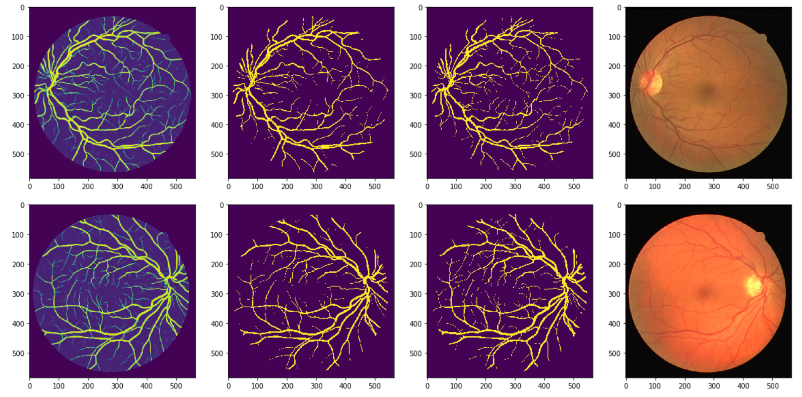

# retinal-blood-vessel-segmentation

Segmenting an image of the retinal vascular tree is an important task when detecting and treating different medical conditions like diabetes and arteriosclerosis. An accurately segmented image includes information about vascular angles, lengths, widths and branching patterns which is valuable for doctors when analyzing patients with such conditions. However, the task of manually segmenting such medical images is costly, time-consuming and error-prone. Thus, research has been conducted to try to automate the complex segmenting process, for example through different machine learning methods. 

In this report, we present three different deep learning architectures that were implemented using a form of Convolutional Neural Network (CNN) called a U-NET, also known as a fully convolutional network. The U-NET consists of two main parts, first the encoder and then the decoder. The encoder functions like a regular CNN, with convolutional and pooling layers to downsample the image while learning different features from the image. The decoder then uses either transposed convolutional layers or nearest neighbor upsampling to locate these features in the image. The use of a large number of channels in the decoder assures that valuable high-level information propagates through the network. To train our U-NETs, the images were masked, divided into patches and grey-scaled before they were fed into the network. 

We also decided to investigate if transfer learning could be useful. This was done by training on the CHASE dataset and then fine-tuning and testing on images from the DRIVE dataset. 

To evaluate the quality of our models, we used four different metrics: accuracy, sensitivity, specificity and AUC. The best overall model was obtained when training and testing on the DRIVE dataset, which gave a sensitivity score of 0.757 and an AUC score of 0.977, where 1 is a perfect score. 

